# Flag Usage Report - WIFT Africa Member Frontend

## Executive Summary

The WIFT Africa member frontend uses **country flags** extensively to represent chapters and locations throughout the application. Flags are fetched from the external **FlagsAPI.com** service and displayed using a centralized utility system with fallback handling.

---

## 1. Flag API Service

### Provider
- **Service**: [FlagsAPI.com](https://flagsapi.com)
- **Format**: `https://flagsapi.com/{ISO_CODE}/flat/64.png`
- **Image Style**: Flat design, 64px resolution

### Configuration

Flags are whitelisted in Next.js configuration for security:

**File**: [next.config.ts](file:///Users/khalidsalman-yusuf/Documents/Unleashified/Active/wift-africa-member-frontend/next.config.ts)

```typescript
// Image remote patterns (lines 33-37)
{
  protocol: "https",
  hostname: "flagsapi.com",
  port: "",
  pathname: "/**",
}

// Content Security Policy (line 65)
img-src 'self' blob: data: ... https://flagsapi.com;
```

---

## 2. Core Utility: Country Mapping

### File: [lib/utils/countryMapping.ts](file:///Users/khalidsalman-yusuf/Documents/Unleashified/Active/wift-africa-member-frontend/lib/utils/countryMapping.ts)

This is the **central utility** for flag handling.

#### Key Functions

##### [getCountryFlagUrl(code?: string, name?: string): string](file:///Users/khalidsalman-yusuf/Documents/Unleashified/Active/wift-africa-member-frontend/lib/utils/countryMapping.ts#62-94)
Generates flag URLs with intelligent fallback logic:

1. **Special Cases**: Returns `'AFRICA'` for HQ/Global chapters (rendered as 🌍 emoji)
2. **Valid ISO Code**: Uses 2-letter code directly
3. **Country Name Mapping**: Looks up ISO code from country name
4. **Fallback**: Returns 'ZZ' (unknown) flag if no match

```typescript
// Example usage
getCountryFlagUrl('GH', 'Ghana')
// Returns: "https://flagsapi.com/GH/flat/64.png"

getCountryFlagUrl('HQ', 'Global')
// Returns: "AFRICA" (special indicator)
```

##### [getCountryIsoCode(code?: string, name?: string): string](file:///Users/khalidsalman-yusuf/Documents/Unleashified/Active/wift-africa-member-frontend/lib/utils/countryMapping.ts#95-109)
Returns just the ISO code without URL construction.

#### Country Mapping Dictionary

**`COUNTRY_TO_CODE`** - Maps 54 African countries to ISO codes:

```typescript
{
  'Egypt': 'EG',
  'Ghana': 'GH',
  'Kenya': 'KE',
  'Nigeria': 'NG',
  'South Africa': 'ZA',
  // ... 49 more countries
}
```

**Coverage**: All 54 African nations

---

## 3. Component Usage

### 3.1 ChapterCard Component

**File**: [components/shared/ChapterCard.tsx](file:///Users/khalidsalman-yusuf/Documents/Unleashified/Active/wift-africa-member-frontend/components/shared/ChapterCard.tsx)

**Usage Pattern**:
```tsx
const flagCode = getCountryIsoCode(code, country)

{flagCode === 'AFRICA' ? (
  <div className="w-12 h-12 rounded-full bg-primary/10 flex items-center justify-center text-2xl">
    🌍
  </div>
) : (
   {
      // Fallback if image fails to load
      (e.target as HTMLImageElement).style.display = 'none';
    }}
  />
)}
```

**Features**:
- 🌍 Globe emoji for HQ/Global chapters
- Error handling with `onError` callback
- Rounded flag display (12x12 container)

### 3.2 ChapterSelectionStep (Onboarding)

**File**: [components/onboarding/ChapterSelectionStep.tsx](file:///Users/khalidsalman-yusuf/Documents/Unleashified/Active/wift-africa-member-frontend/components/onboarding/ChapterSelectionStep.tsx)

**Usage Pattern**:
```tsx
const getCountryFlag = (countryCode: string, countryName: string) => {
  const flagUrl = getCountryFlagUrl(countryCode, countryName)
  if (flagUrl === 'AFRICA') return '🌍'
  return flagUrl
}
```

Uses [ChapterCard](file:///Users/khalidsalman-yusuf/Documents/Unleashified/Active/wift-africa-member-frontend/components/shared/ChapterCard.tsx#21-169) component which handles flag rendering.

### 3.3 Chapter Detail Page

**File**: [app/(authenticated)/chapters/[id]/page.tsx](file:///Users/khalidsalman-yusuf/Documents/Unleashified/Active/wift-africa-member-frontend/app/(authenticated)/chapters/[id]/page.tsx)

**Usage Pattern**:
```tsx
<Image
  src={getCountryFlagUrl(chapter.code, chapter.country)}
  alt={`${chapter.country} flag`}
  width={48}
  height={48}
  className="rounded-full"
/>
```

Uses Next.js `Image` component for optimized loading.

---

## 4. Data Flow

```mermaid
graph TD
    A[Backend API] -->|Chapter Data| B[Frontend Component]
    B -->|code, country| C[getCountryFlagUrl]
    C -->|Check Special Cases| D{Is HQ/Global?}
    D -->|Yes| E[Return 'AFRICA']
    D -->|No| F{Valid ISO Code?}
    F -->|Yes| G[Generate URL]
    F -->|No| H[Lookup in COUNTRY_TO_CODE]
    H --> G
    E --> I[UI Renders 🌍]
    G --> J[UI Renders Flag Image]
    J -->|Error| K[Fallback Handling]
```



---

## 5. Implementation Patterns

### Pattern 1: Direct URL Construction
```tsx

```
Used in: [ChapterCard.tsx](file:///Users/khalidsalman-yusuf/Documents/Unleashified/Active/wift-africa-member-frontend/components/shared/ChapterCard.tsx)

### Pattern 2: Utility Function
```tsx
const flagUrl = getCountryFlagUrl(code, country)
```
Used in: [ChapterSelectionStep.tsx](file:///Users/khalidsalman-yusuf/Documents/Unleashified/Active/wift-africa-member-frontend/components/onboarding/ChapterSelectionStep.tsx), `chapters/[id]/page.tsx`

### Pattern 3: Conditional Rendering
```tsx
{flagCode === 'AFRICA' ? '🌍' : }
```
Used in: All components

---

## 6. Special Cases Handling

### HQ/Global Chapters
- **Code**: `'HQ'` or `'AFRICA'`
- **Rendering**: 🌍 globe emoji instead of flag
- **Styling**: Circular background with primary color tint

### Unknown/Invalid Countries
- **Fallback Code**: `'ZZ'`
- **URL**: `https://flagsapi.com/ZZ/flat/64.png`
- **Error Handling**: `onError` callback hides broken images

---

## 7. Recommendations for Admin Codebase

### ✅ Reuse Existing Utilities

**Copy these files to admin codebase**:
1. [lib/utils/countryMapping.ts](file:///Users/khalidsalman-yusuf/Documents/Unleashified/Active/wift-africa-member-frontend/lib/utils/countryMapping.ts) - Complete utility
2. Update [next.config.ts](file:///Users/khalidsalman-yusuf/Documents/Unleashified/Active/wift-africa-member-frontend/next.config.ts) with FlagsAPI whitelist

### ✅ Component Pattern

Use the proven pattern from [ChapterCard.tsx](file:///Users/khalidsalman-yusuf/Documents/Unleashified/Active/wift-africa-member-frontend/components/shared/ChapterCard.tsx):

```tsx
import { getCountryIsoCode } from '@/lib/utils/countryMapping'

const FlagDisplay = ({ code, country }: { code: string; country: string }) => {
  const flagCode = getCountryIsoCode(code, country)
  
  if (flagCode === 'AFRICA') {
    return <div className="flag-container">🌍</div>
  }
  
  return (
     {
        (e.target as HTMLImageElement).style.display = 'none'
      }}
    />
  )
}
```

### ✅ Configuration Steps

**1. Next.js Config** (if using Next.js):
```typescript
// next.config.ts
images: {
  remotePatterns: [
    {
      protocol: "https",
      hostname: "flagsapi.com",
      pathname: "/**",
    }
  ]
}
```

**2. Content Security Policy**:
```typescript
headers: [
  {
    key: "Content-Security-Policy",
    value: "img-src 'self' https://flagsapi.com;"
  }
]
```

### ✅ Best Practices

1. **Always use utility functions** - Don't hardcode flag URLs
2. **Handle special cases** - Check for HQ/Global chapters
3. **Implement error handling** - Use `onError` callbacks
4. **Maintain country mapping** - Keep `COUNTRY_TO_CODE` updated
5. **Consistent sizing** - Use standard dimensions (48px or 64px)

### ⚠️ Considerations

1. **External Dependency**: FlagsAPI.com is a third-party service
   - Consider caching flags locally for production
   - Monitor API availability
   
2. **Performance**: 
   - Use Next.js `Image` component for optimization
   - Consider lazy loading for long lists

3. **Accessibility**:
   - Always include descriptive `alt` text
   - Ensure sufficient color contrast for globe emoji

---

## 8. Code Examples for Admin

### Example 1: Chapter List with Flags
```tsx
import { getCountryFlagUrl } from '@/lib/utils/countryMapping'

const ChapterList = ({ chapters }) => {
  return chapters.map(chapter => {
    const flagUrl = getCountryFlagUrl(chapter.code, chapter.country)
    
    return (
      <div key={chapter.id}>
        {flagUrl === 'AFRICA' ? (
          <span>🌍</span>
        ) : (
          
        )}
        <span>{chapter.name}</span>
      </div>
    )
  })
}
```

### Example 2: Admin Dashboard Stats
```tsx
const CountryStats = ({ countryCode, countryName, memberCount }) => {
  const flagUrl = getCountryFlagUrl(countryCode, countryName)
  
  return (
    <div className="stat-card">
      
      <h3>{countryName}</h3>
      <p>{memberCount} members</p>
    </div>
  )
}
```

---

## 9. Summary

### Current Implementation
- ✅ Centralized utility system
- ✅ Comprehensive country coverage (54 African nations)
- ✅ Special case handling (HQ/Global)
- ✅ Error handling and fallbacks
- ✅ Security configuration (CSP, image whitelist)

### For Admin Codebase
- **Copy**: [lib/utils/countryMapping.ts](file:///Users/khalidsalman-yusuf/Documents/Unleashified/Active/wift-africa-member-frontend/lib/utils/countryMapping.ts)
- **Configure**: Next.js image domains and CSP
- **Reuse**: Component patterns from [ChapterCard.tsx](file:///Users/khalidsalman-yusuf/Documents/Unleashified/Active/wift-africa-member-frontend/components/shared/ChapterCard.tsx)
- **Maintain**: Keep country mapping dictionary updated

### Key Files Reference
1. [countryMapping.ts](file:///Users/khalidsalman-yusuf/Documents/Unleashified/Active/wift-africa-member-frontend/lib/utils/countryMapping.ts) - Core utility
2. [ChapterCard.tsx](file:///Users/khalidsalman-yusuf/Documents/Unleashified/Active/wift-africa-member-frontend/components/shared/ChapterCard.tsx) - Reference implementation
3. [next.config.ts](file:///Users/khalidsalman-yusuf/Documents/Unleashified/Active/wift-africa-member-frontend/next.config.ts) - Configuration

---

**Report Generated**: 2026-02-10  
**Codebase**: WIFT Africa Member Frontend  
**Purpose**: Admin Codebase Integration Guide
